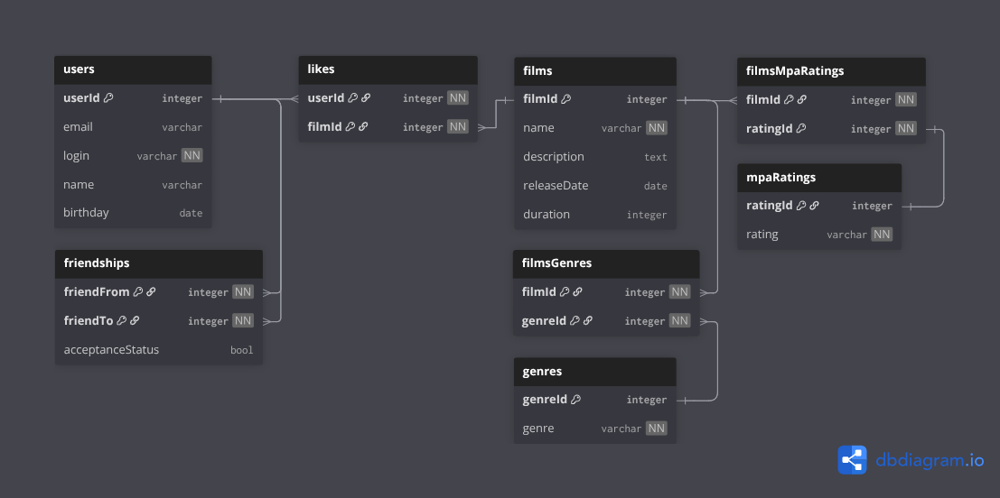

# java-filmorate

## Схема базы данных

Файл со схемой: _dbSchema/DB_schema.png_



## Примеры запросов к базе данных

"__" - означает данные, которые будут подставляться при отправке запроса из кода.

### Пользователи

Получение всех пользователей:
```
SELECT userId,
       email,
       login,
       name,
       birthday
FROM users;
```

Получение пользователя по id:
```
SELECT userId,
       email,
       login,
       name,
       birthday
FROM users
WHERE userId = __;
```

Получение друзей пользователя:
```
SELECT u.userId,
       u.email,
       u.login,
       u.name,
       u.birthday
FROM users u
JOIN friendships f ON u.userId = f.friendTo
WHERE f.friendFrom = __
  AND f.acceptanceStatus = TRUE
UNION
SELECT u.userId,
       u.email,
       u.login,
       u.name,
       u.birthday
FROM users u
JOIN friendships f ON u.userId = f.friendFrom
WHERE f.friendTo = __
  AND f.acceptanceStatus = TRUE;
```

Получение общих друзей:
```
WITH user1_friends AS
  (SELECT friendTo AS friendId
   FROM friendships
   WHERE friendFrom = __
     AND acceptanceStatus = TRUE
   UNION SELECT friendFrom AS friendId
   FROM friendships
   WHERE friendTo = __
     AND acceptanceStatus = TRUE),
     user2_friends AS
  (SELECT friendTo AS friendId
   FROM friendships
   WHERE friendFrom = __
     AND acceptanceStatus = TRUE
   UNION SELECT friendFrom AS friendId
   FROM friendships
   WHERE friendTo = __
     AND acceptanceStatus = TRUE)
SELECT u.userId,
       u.email,
       u.login,
       u.name,
       u.birthday
FROM users u
JOIN user1_friends u1f ON u.userId = u1f.friendId
JOIN user2_friends u2f ON u.userId = u2f.friendId;
```

Создание пользователя:
```
INSERT INTO users (email, login, name, birthday)
VALUES (__, __, __, __);
```

Редактирование пользователя:
```
UPDATE users
SET email = __,
    login = __,
    name = __,
    birthday = __
WHERE userId = __;
```

Добавление в друзья:
```
INSERT INTO friendships (friendFrom, friendTo, acceptanceStatus)
VALUES (__, __, FALSE);
```

Удаление из друзей:
```
DELETE
FROM friendships
WHERE (friendFrom = __
       AND friendTo = __)
  OR (friendFrom = __
      AND friendTo = __);
```

### Фильмы

Получение всех фильмов:
```
SELECT filmId,
       name,
       description,
       releaseDate,
       duration
FROM films;
```

Получение фильма по id:
```
SELECT filmId,
       name,
       description,
       releaseDate,
       duration
FROM films
WHERE filmId = __;
```

Получение фильмов с наибольшим количеством лайков:
```
SELECT f.filmId,
       f.name,
       f.description,
       f.releaseDate,
       f.duration,
       COUNT(l.userId) AS likeCount
FROM films f
LEFT JOIN likes l ON f.filmId = l.filmId
GROUP BY f.filmId,
         f.name,
         f.description,
         f.releaseDate,
         f.duration
ORDER BY likeCount DESC
LIMIT __;
```

Добавление фильма:
```
INSERT INTO films (name, description, releaseDate, duration)
VALUES (__, __, __, __);
```

Изменение фильма:
```
UPDATE films
SET name = __,
    description = __,
    releaseDate = __,
    duration = __
WHERE filmId = __;
```

Добавление лайка:
```
INSERT INTO likes (userId, filmId)
VALUES (__, __);
```

Удаление лайка:
```
DELETE
FROM likes
WHERE userId = __
  AND filmId = __;
```
